# 代码检查使用文档

### codecc简介

通过代码扫描，能找出代码隐藏的错误和缺陷，如内存泄漏，空指针引用，死代码，变量未初始化，复制粘贴错误，重复代码，函数复杂度过高等

**codecc接入步骤：**

1. 配置代码库，作为代码扫描的目标
2. 创建流水线，拉取目标代码
3. 配置代码分析插件
4. 执行流水线
5. 查看代码检查结果

### codecc接入

#### 配置代码库

「选择项目」-「服务」-「代码库」

「关联代码库」-「gitlab代码库」 这里以gitlab代码库为例

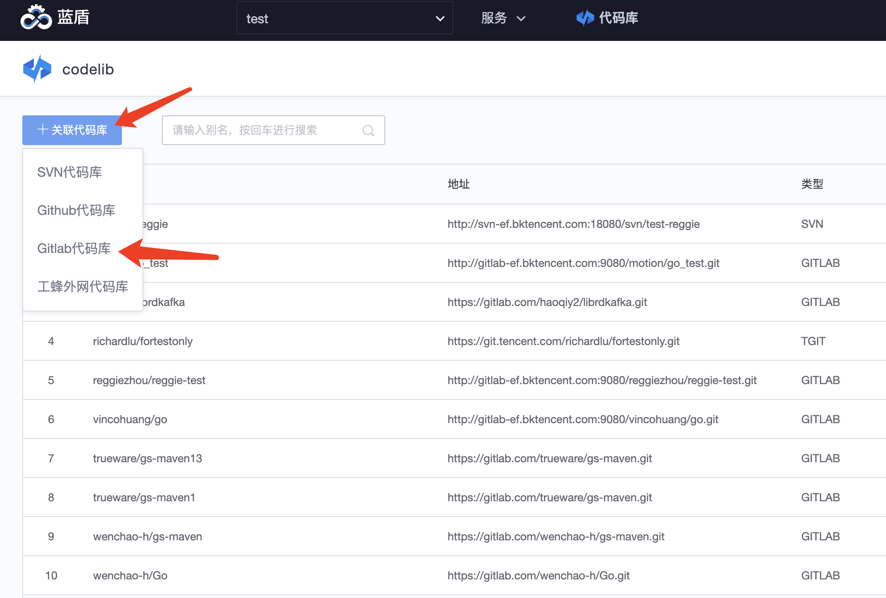

**关联gitlab代码库有几个条件：**

1. 使用accesstoken来关联
2. 创建accesstoken的所有者须是目标仓库的maintainer角色
3. accesstoken至少需要read\_api的权限
4. 源代码地址是http/https协议的

accesstoken 使用「凭证管理」来进行注册，如果在「凭证管理」已经注册accesstoken，关联代码库时，可直接选中对应的accesstoken

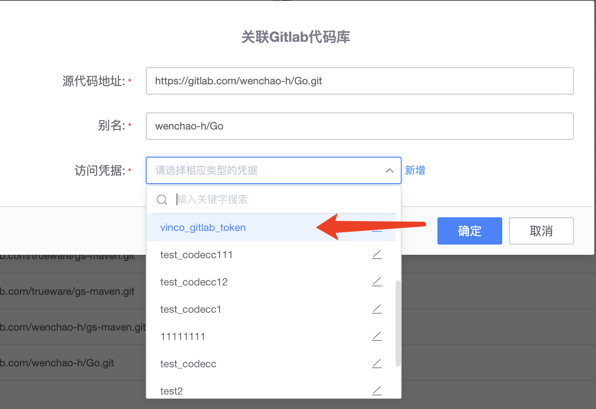

如果在「凭证管理」注册accesstoken，则可以新增凭证，跳转至凭证管理页面

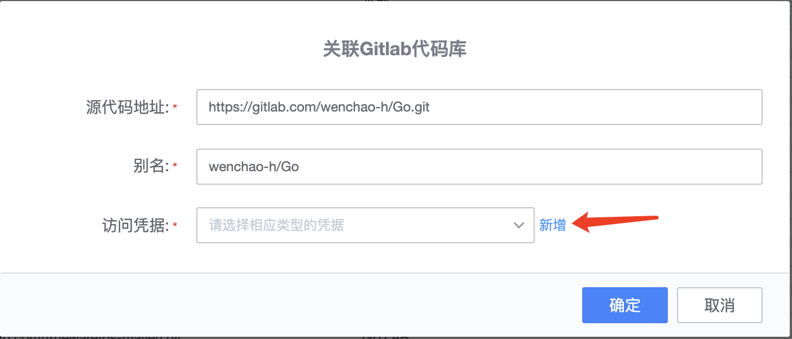

gitlab accesstoken创建请参考：https://docs.gitlab.com/ee/user/profile/personal\_access\_tokens.html

然后回到关联代码库页面，选中刚创建的accesstoken，确定

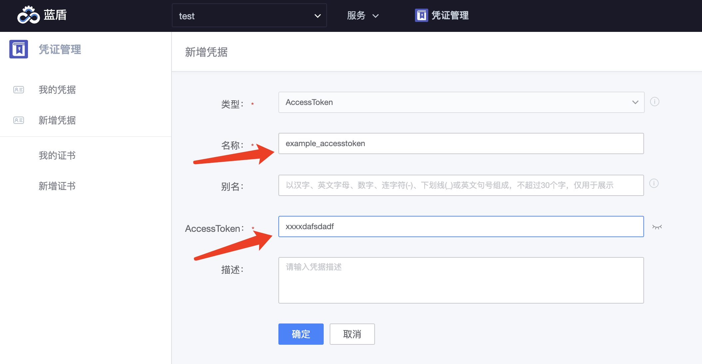

#### 创建流水线

「选择项目」-「服务」-「流水线」-「新建流水线」-「项目自定义」-「填写流水线名称」-「新建」

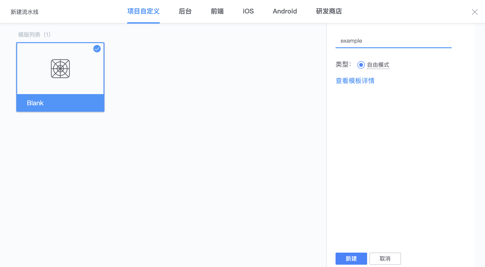

流水线新建好后，需要添加代码拉取的插件以及代码分析的插件，代码分析需要将代码拉取到构建环境所在的工作空间，拉取代码需要选择checkout gitlab插件

「添加stage」-「选择linux构建机」-「新增插件」-「选择checkout gitlab插件」

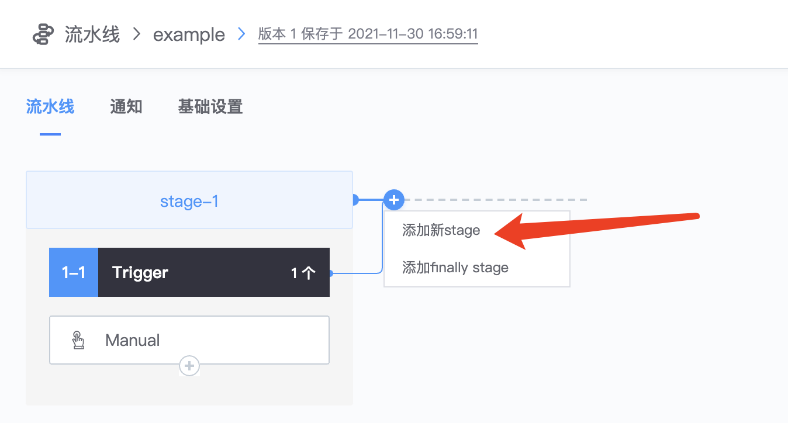

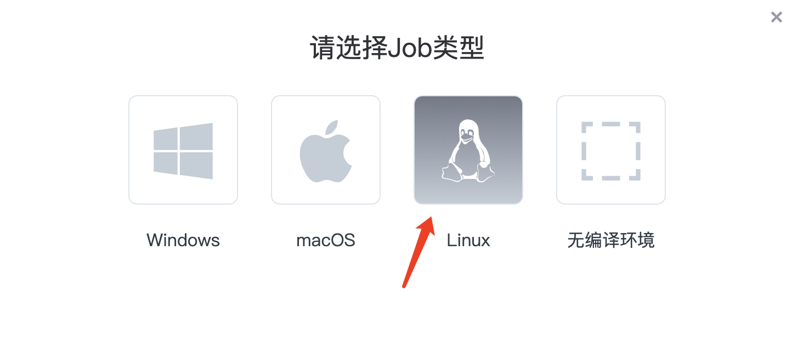

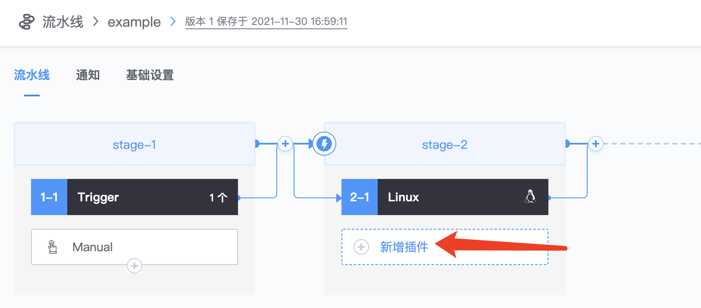

配置checkout gitlab插件，选择代码库为前述步骤创建的代码库

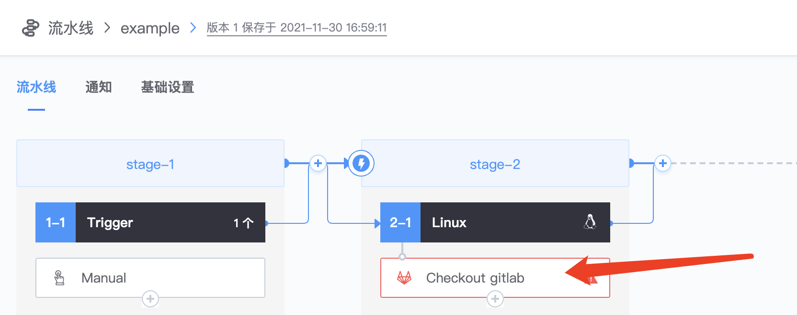

#### 配置代码分析

添加代码分析插件

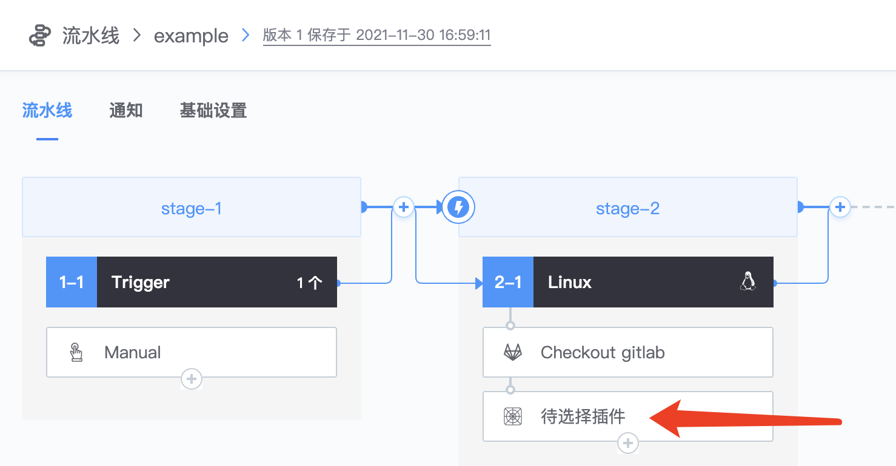

配置代码分析，选择同步方式，「基础设置」根据代码库语言选择对应的工程语言，选择对应的规则集，规则集就是codecc进行代码扫描遵循的标准，codecc会提供默认的规则集，如果规则集不满足需求，可以自定义规则集。「扫描配置」选择增量扫描，「路径屏蔽」可以设置路径白名单，一旦设置后，代码分析只会扫描白名单路径下的文件；配置路径黑名单，则代码分析插件不会扫描该路径下的文件。

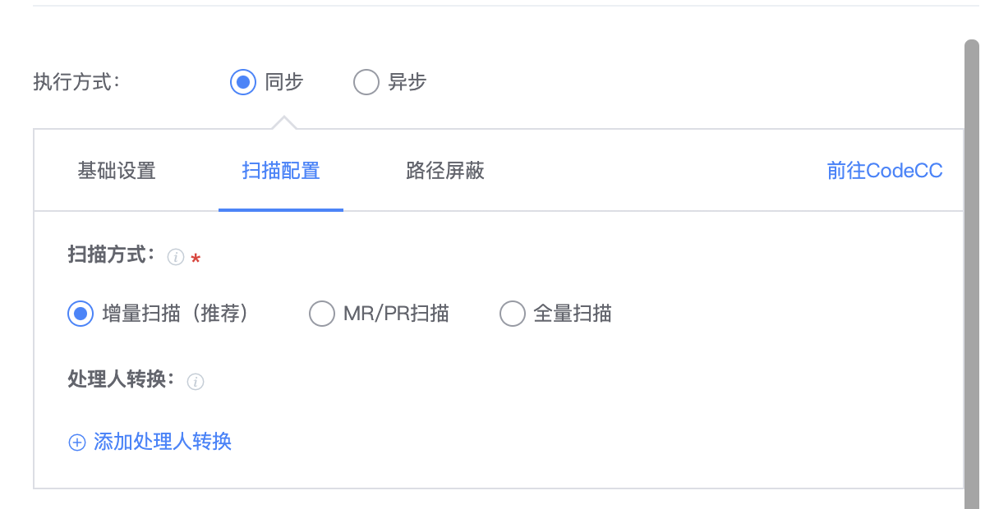

路径支持通配符，如果是完整路径，须以/开头，如需要屏蔽的文件是repo-name/initial/src/main/java/hello/HelloWorld.java，则路径白名单是/initial/src/main/java/hello/HelloWorld.java

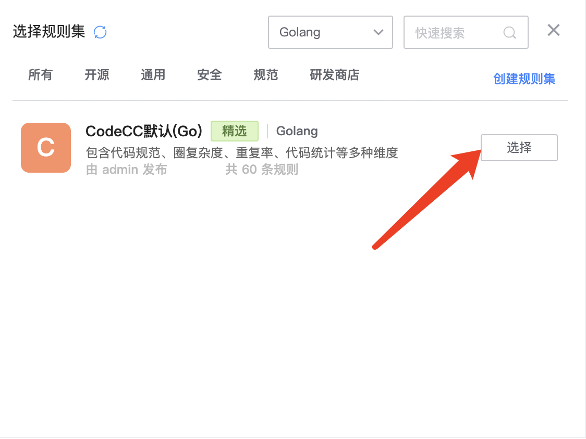

#### 执行流水线

流水线全貌：

保存并执行流水线：

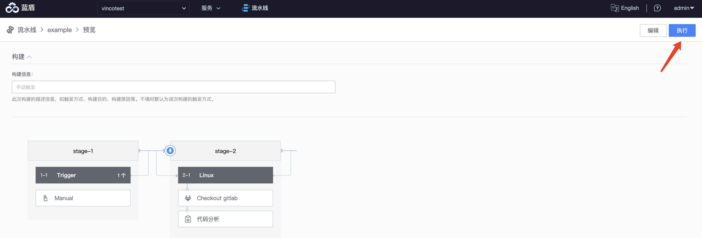

#### 查看代码检查结果

「等待执行完毕」-「点击代码分析插件」-「查看报告」

点击数字可以跳转查看具体的问题

跳转到codecc详情页面，会展示具体的代码问题以及问题严重程度，点击「位置」可以定位到代码问题的具体位置

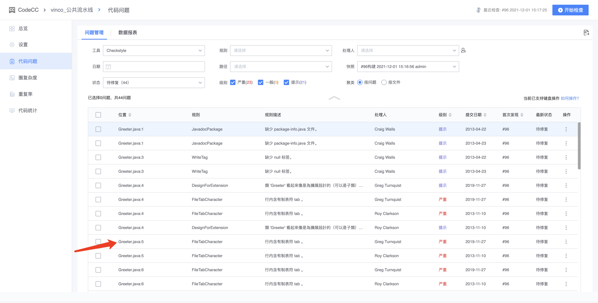

点击「问题位置」可快速定位有代码问题的具体位置，开发者手动处理代码问题，如已修复问题并提交到下一次commit，可以点击「标记处理」，如果下次的检查仍有问题，将会突出显示

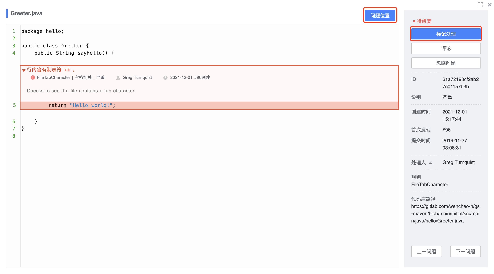

如果该规则和开发者自身的设计不匹配，或者不符合开发者自身的代码风格，认为无需在意该问题的扫描，可以选择「忽略问题」；问题忽略后，将不会在待修复列表中出现

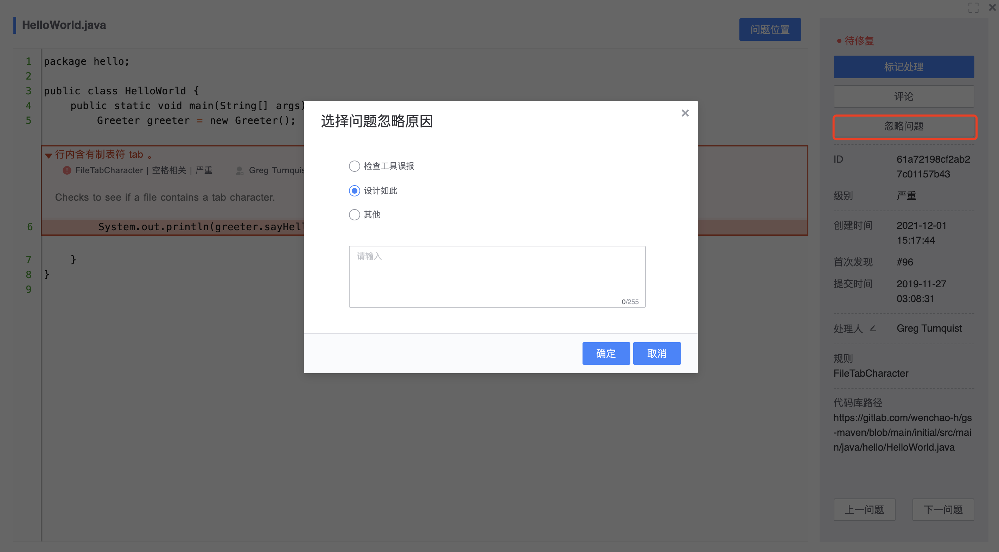

代码问题的「数据报表」功能，可以观察到多次代码分析结果的变化趋势

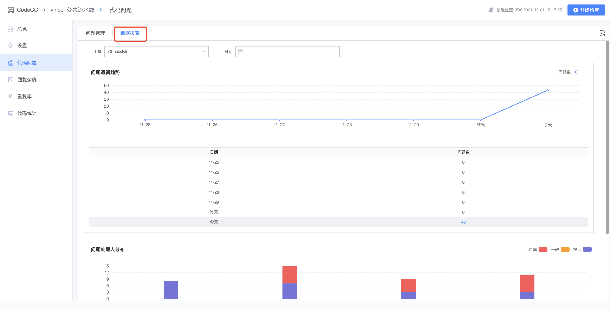

总览可以看到关于本次代码分析的统计结果

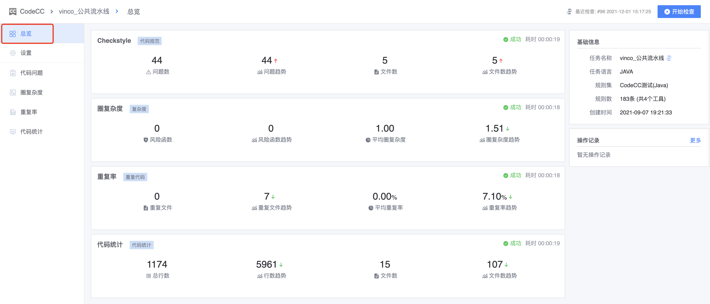

### 自定义规则集

默认的规则集中规则数目比较少，不满足用户的需求，或者规则集中有某些规则不符合企业或者开发者的代码风格，这时候可以创建自定义规则集

> 场景模拟：CodeCC默认(C++)默认规则集中的「build/include\_what\_you\_use」规则不符合本企业的代码开发风格，希望去除该规则

#### 创建规则集

自定义规则集和项目相关，创建自定义规则集前需选择目标项目

「基于」选择CodeCC默认(C++)，自定义规则集就能在该默认规则集上增删

#### 增删规则

基于CodeCC默认(C++)的自定义规则集，默认会包含CodeCC默认(C++)所有规则条目，用户可以已定位到不需要的规则「build/include\_what\_you\_use」，并取消勾选，保存规则集

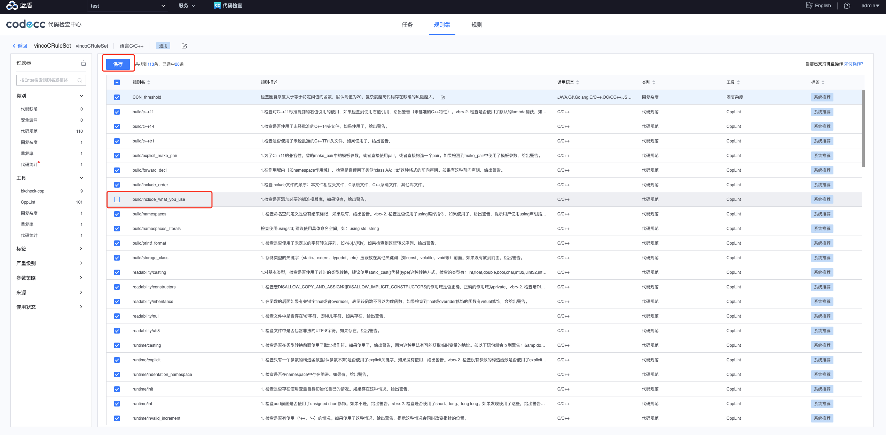

#### 流水线重新选择自定义规则集

在流水线里取消默认规则集，选择自定义规则集，重新保存流水线即可

